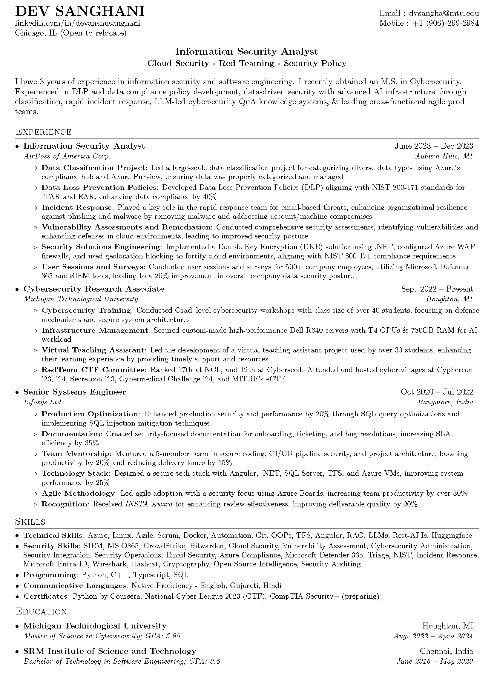

# Resume of Dev Sanghani

This repository contains the LaTeX source code for generating the resume of Dev Sanghani, a cybersecurity professional. The LaTeX document is designed to be highly customizable and easy to maintain, suitable for professionals seeking a clean and effective way to present their credentials.

## Resume Preview

## Repository Structure

- `Dev_Sanghani_Resume.pdf` - The final output of the compiled LaTeX document, showcasing Dev Sanghani's professional resume.
- `main.tex` - The LaTeX source code file which contains all the styling and content of the resume.

## LaTeX Code Explanation

### Packages and Document Configuration
- **geometry**: Sets the margins of the document.
- **hyperref**: Provides hyperlink capabilities within the document.
- **enumitem**: Allows customization of list environments.
- **titlesec**: Customizes section titles.
- **marvosym, ifsym**: Adds various symbols to the document.
- **fancyhdr**: Used for customizing headers and footers.
- **xcolor**: Adds color support to the document.

### Page Style and Margins
Custom page styles are defined using `fancyhdr` to have clean headers and footers. Margins are adjusted to optimize space.

### Section Formatting
Sections are formatted with custom commands and `titleformat` to ensure a visually appealing layout.

### Custom Commands
- `\resumeItem`: Defines the structure for items in a list, typically used to describe responsibilities or achievements.
- `\resumeSubheading`: Used to specify the subheadings such as job positions or educational qualifications.
- `\resumeSubItem`: Similar to `\resumeItem`, but used for sub-items within a section.

### Content Sections
- **Heading**: Contains contact information and links.
- **Experience**: Details professional experiences, roles, and responsibilities.
- **Skills**: Lists technical and professional skills.
- **Education**: Outlines educational background.
- **Projects and Events**: Highlights involvement in competitions and conferences.

## Resume Display

To view Dev Sanghani's resume, download the `Dev_Sanghani_Resume.pdf` file from this repository.

## Usage

To compile the `main.tex` file to a PDF:
1. Ensure you have a LaTeX editor like TeXShop (for Mac) or TeXworks (Windows/Linux).
2. Open `main.tex` with the editor.
3. Compile the document to generate the PDF output.

For modifications, you can edit the `main.tex` file directly in your LaTeX editor, customizing it as per your requirements.
